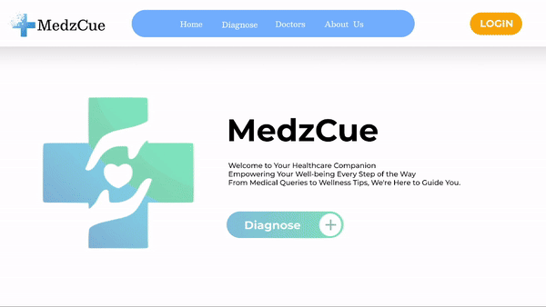

# Medz Cue | A Machine Learning Web Application

## Table of Content  
Problem statment / Why this topic?  
Flow Chart / Archeticture  
Directory Tree  
Quick start  
Screenshots  
Technical Aspect  
Team  
License  

# Prerequisite

1. **Web Development Basics**: Understand frontend and backend development concepts.  
2. **Machine Learning Fundamentals**: Learn supervised learning for disease prediction.  
3. **Database Management**: Familiarize yourself with SQL or NoSQL databases.  
4. **API Development**: Learn to create RESTful APIs for communication.  
5. **Recommendation Systems**: Understand how to suggest doctors based on user data.  
6. **Authentication & Authorization**: Implement user login/signup and session management.  

# Install Dependencies

*For Backend server application* - install node modules, nodemon,bcrypt,jsonwebtokens,express,mongoose,cloudinary,body-parser,cookie-parser,dotenv through the command 'npm i', make sure to change dev script to nodemon index.js to run the index.js file on any occuring changes

## Env Variables

Make Sure to Create a config.env file in backend/config directory and add appropriate variables in order to use the app.

*Essential Variables*  
DATABASE_URL=
PORT = 
fill each filed with your info respectively

# UI
  
link to video: https://drive.google.com/drive/folders/1LpkBnP7-WG6gmWtiNvwOWhlquX8hNga_?usp=drive_link

# ML Model
## Disease Prediction from Symptoms

This project aims to utilize machine learning algorithms to predict diseases based on symptoms, determining the appropriate specialist needed. Additionally, it provides recommendations for doctors based on their ratings, availability, and geographical location, enhancing the accessibility and quality of healthcare services.

### Algorithms Explored

The following algorithms have been explored in code:

- Logistic Regression
- Decision Tree
- Random Forest
- SVM
- Naive Bayes
- K-Nearest Neighbors
- Multilayer Perceptron
- CatBoost 

# Dataset

The dataset for this problem used with the `main.ipynb` script is downloaded from here:

```
https://www.kaggle.com/datasets/ebrahimelgazar/doctor-specialist-recommendation-system
```

## Interactive Demo

For running an interactive demo or sharing it with others, please run `main.ipynb` using Jupyter Notebook or Jupyter Lab.

```
jupyter notebook ML_Model/main.ipynb
```
